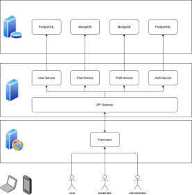

# WeTalk

## Présentation du projet

Le projet WeTalk vise à développer un réseau social léger et réactif, inspiré de Twitter/X, mais optimisé pour des environnements à faibles ressources. L’objectif est de concevoir une application qui permet de publier des messages courts, d’interagir avec les autres utilisateurs, et de maintenir une expérience utilisateur rapide et fluide.

L’équipe utilisera des technologies modernes pour garantir la robustesse et la scalabilité de l’application. Le back-end sera développé en Node.js avec le framework Express, gérant les requêtes via une API RESTful. Pour l'authentification et la gestion des sessions utilisateurs, nous mettrons en œuvre des JWT (JSON Web Tokens), assurant ainsi la sécurité des échanges. Le front-end sera construit en React, avec une approche mobile-first, garantissant une interface réactive et intuitive, adaptée à tous les formats d'écran.

Pour simplifier le déploiement et la gestion des environnements de développement, nous utiliserons Docker pour containeriser les services. Cette approche garantit une mise en production rapide, portable et fiable tout en facilitant la gestion des dépendances.

## Architecture

L'application sera composée de plusieurs microservices interconnectés, chacun ayant une responsabilité distincte. Le schéma ci-dessous représente une base pour vous aider dans le lancement de votre projet. Si vous jugez nécessaire de retirer ou d'ajouter des services, cela est possible, mais attention à votre charge de travail.

Description de l'image :

1. La couche Client (Front-end) : Les utilisateurs (User, Moderator, Administrator) accèdent à l'application via des appareils (PC, mobile) qui communiquent avec une interface unique développée en Next.js.

2. La couche Serveur (Back-end) : Les requêtes du Front passent d'abord par une API Gateway, qui sert de point d'entrée unique et redirige le trafic vers 4 microservices indépendants :
- User Service (Gestion des utilisateurs)
- Post Service (Gestion des publications)
- Profil Service (Gestion des profils)
- Auth Service (Gestion de l'authentification)

3. La couche Données (Database) : Chaque microservice possède sa propre base de données dédiée pour garantir l'indépendance du système :
- PostgreSQL pour User Service et Auth Service.
- MongoDB pour Post Service and Profil Service.

## Technologies à utiliser

### Back-end (Node.js & Express) :

#### Technologies utilisées :

- Node.js
- Express.js
- JWT (JSON Web Tokens)
- MongoDB
- Mongoose
- Sequelize
- PostgreSQL

#### Sécurisation :

- Authentification JWT
- Gestion des erreurs
- CORS (Cross-Origin Resource Sharing)

#### Performance :

- Docker

### Front-end (React & Next.js) :

#### Technologies utilisées :

- React.js
- Next.js
- Tailwind CSS
- Axios
- React Router

#### Réactivité et UX/UI :

- Mobile-first
- Responsive
- Gestion des erreurs UI

#### Gestion des sessions :

- Stockage des JWT
- Redirection après authentification

## Fonctionnalités attendu

### Gestion des Comptes & Profils
- [ ] **Fx1. Création de comptes utilisateurs avec validation**
  *En tant que* visiteur, *je veux* créer un compte utilisateur *afin de* pouvoir accéder aux fonctionnalités de la plateforme.
- [ ] **Fx2. Authentification sécurisée**
  *En tant qu'*utilisateur, *je veux* pouvoir me connecter de manière sécurisée *pour* protéger mes informations personnelles.
- [ ] **Fx10. Profil utilisateur avec informations de base**
  *En tant qu'*utilisateur, *je veux* une page de profil affichant mon nom, ma biographie courte et ma photo de profil *pour* me présenter aux autres.
- [ ] **Fx4. Affichage des messages sur le profil**
  *En tant qu'*utilisateur, *je veux* voir tous mes messages affichés sur mon profil *afin de* les consulter ou les modifier.
- [ ] **Fx11. Liste des messages publiés par l'utilisateur sur le profil**
  *En tant qu'*utilisateur, *je veux* voir la liste de mes messages publiés sur ma page de profil.

### Publications & Interactions
- [ ] **Fx3. Publication de messages courts**
  *En tant qu'*utilisateur, *je veux* publier des messages courts (ex. : 280 caractères) *pour* partager mes idées avec mes abonnés.
- [ ] **Fx5. Flux chronologique des messages des utilisateurs suivis**
  *En tant qu'*utilisateur, *je veux* un fil d'actualités avec les messages des utilisateurs que je suis *pour* rester à jour avec leur contenu.
- [ ] **Fx6. Liker un post**
  *En tant qu'*utilisateur, *je veux* liker un post *pour* montrer mon appréciation.
- [ ] **Fx7. Répondre à un post sous forme de commentaire**
  *En tant qu'*utilisateur, *je veux* répondre à un post *pour* partager mes réactions ou avis.
- [ ] **Fx8. Répondre à un commentaire sur un post**
  *En tant qu'*utilisateur, *je veux* répondre à un commentaire sur un post *pour* participer à une discussion.
- [ ] **Fx9. Suivre ou être suivi par d'autres utilisateurs**
  *En tant qu'*utilisateur, *je veux* pouvoir suivre d'autres utilisateurs *pour* voir leur contenu dans mon fil d'actualités.

### Navigation & Recherche
- [ ] **Fx12. Ajout de tags aux messages**
  *En tant qu'*utilisateur, *je veux* ajouter des tags à mes messages *pour* les catégoriser.
- [ ] **Fx13. Recherche de posts via des tags**
  *En tant qu'*utilisateur, *je veux* rechercher des messages via des tags *pour* trouver du contenu pertinent.

### Expérience Utilisateur & Personnalisation
- [ ] **Fx22. Interface multi-langues**
  *En tant qu'*utilisateur, *je veux* choisir ma langue préférée *pour* utiliser l'application confortablement.
- [ ] **Fx23. Thème personnalisé**
  *En tant qu'*utilisateur, *je veux* personnaliser le thème de l'application *pour* améliorer mon expérience visuelle.

## Matrice de permission

| Fonctionnalité (Fx) | Visiteur | Utilisateur | Modérateur | Administrateur |
| :--- | :---: | :---: | :---: | :---: |
| **Fx1.** Création de comptes utilisateurs | ✅ | ❌ | ❌ | ✅ |
| **Fx2.** Authentification sécurisée | ❌ | ✅ | ✅ | ✅ |
| **Fx3.** Publication de messages courts | ❌ | ✅ | ✅ | ✅ |
| **Fx4.** Affichage des messages sur le profil | ❌ | ✅ *(Sien uniquement)* | ✅ | ✅ |
| **Fx5.** Flux chronologique des messages | ❌ | ✅ | ✅ | ✅ |
| **Fx6.** Liker un post | ❌ | ✅ | ✅ | ✅ |
| **Fx7.** Répondre à un post sous forme de commentaire | ❌ | ✅ | ✅ | ✅ |
| **Fx8.** Répondre à un commentaire sur un post | ❌ | ✅ | ✅ | ✅ |
| **Fx9.** Suivre ou être suivi par d'autres utilisateurs | ❌ | ✅ | ✅ | ✅ |
| **Fx10.** Profil utilisateur avec informations de base | ❌ | ✅ | ✅ | ✅ |
| **Fx11.** Liste des messages publiés sur le profil | ❌ | ✅ | ✅ | ✅ |
| **Fx12.** Ajout de tags aux messages | ❌ | ✅ | ✅ | ✅ |
| **Fx13.** Recherche de posts via des tags | ❌ | ✅ | ✅ | ✅ |
| **Fx14.** Notifications pour les mentions | ❌ | ✅ | ✅ *(Modération)* | ✅ *(Admin)* |
| **Fx15.** Notifications pour les likes | ❌ | ✅ | ❌ | ❌ |
| **Fx16.** Notifications pour les nouveaux followers | ❌ | ✅ | ❌ | ❌ |
| **Fx17.** Système de messages privés entre utilisateurs | ❌ | ✅ | ✅ | ✅ |
| **Fx18.** Ajout d’images aux messages | ❌ | ✅ | ✅ | ✅ |
| **Fx19.** Ajout de vidéos aux messages | ❌ | ✅ | ✅ | ✅ |
| **Fx20.** Signalement de contenu inapproprié | ❌ | ✅ | ✅ | ✅ |
| **Fx21.** Suspension ou bannissement des utilisateurs | ❌ | ❌ | ✅ | ✅ |
| **Fx22.** Interface multi-langues | ❌ | ✅ | ✅ | ✅ |
| **Fx23.** Thème personnalisé | ✅ | ✅ | ✅ | ✅ |